# Neptune Core P2P System - Integrated Architecture

## 🏗️ **Complete System Architecture**

This document shows the complete integrated architecture of Neptune Core's P2P networking system, including how the new libp2p-based system is wired up to the main application layer.

## 🔄 **System Overview**


## 🔌 **Integration Points**

### **1. Application Layer Integration**

The main Neptune Core application communicates with the P2P system through the `P2pIntegrationService`:

```rust
// Application sends messages to P2P system
let app_message = ApplicationMessage::BroadcastBlock {
    block_data: block_bytes,
    block_hash: block_hash,
};

// P2P system sends events back to application
let network_event = NetworkEvent::BlockReceived {
    block_data: block_bytes,
    block_hash: block_hash,
    source: "legacy_peer".to_string(),
};
```

### **2. Message Routing**

The integration service routes messages between different network layers:


## 🏛️ **Detailed Component Architecture**

### **P2P Integration Service**


### **Legacy Compatibility Bridge**

```mermaid
graph TB
    subgraph "LegacyBridge"
        A[Bridge Controller] --> B[LegacyNetworkService]
        A --> C[MessageAdapter]
        A --> D[MigrationManager]
    end

    subgraph "Legacy Network"
        B --> E[TCP Listener]
        B --> F[Connection Manager]
        B --> G[Message Handler]
    end

    subgraph "Protocol Translation"
        C --> H[Legacy → Internal]
        C --> I[Internal → Legacy]
        C --> J[libp2p → Internal]
        C --> K[Internal → libp2p]
    end

    subgraph "Migration Control"
        D --> L[Phase Management]
        D --> M[Progress Tracking]
        D --> N[Peer Migration]
    end
```



### **New P2P Network System**


## 🔄 **Message Flow Architecture**

### **Complete Message Flow**


### **Legacy ↔ libp2p Message Translation**


## 🌐 **Network Topology Integration**

### **Hybrid Network Topology**


## ⚙️ **Configuration Integration**

### **Network Mode Configuration**


## 🔧 **Implementation Details**

### **Service Lifecycle Management**


### **Error Handling and Recovery**


## 📊 **Monitoring and Metrics**

### **Integration Health Dashboard**


## 🚀 **Migration Strategy**

### **Phased Migration Process**


## 🎯 **Key Benefits of Integration**

### **1. Seamless Migration**

- **Zero Downtime**: Both systems run simultaneously
- **Gradual Transition**: Peers migrate at their own pace
- **Backward Compatibility**: Legacy peers continue working

### **2. Enhanced Functionality**

- **Zero-Config Startup**: No --peer flag required
- **Automatic Discovery**: DHT-based peer discovery
- **Advanced Protocols**: Circuit relay, AutoNAT, DCUtR

### **3. Network Resilience**

- **Multiple Discovery Methods**: DHT, mDNS, Rendezvous
- **NAT Traversal**: Automatic NAT detection and relay
- **Connection Resilience**: Automatic reconnection and recovery

### **4. Monitoring and Management**

- **Unified Status**: Single interface for both networks
- **Health Monitoring**: Comprehensive network health scoring
- **Performance Metrics**: Detailed network performance data

## 🔮 **Future Enhancements**

### **Planned Features**

- **Peer Reputation System**: Track peer reliability and performance
- **Automatic Load Balancing**: Distribute connections across networks
- **Advanced Routing**: Intelligent message routing based on peer capabilities
- **Network Analytics**: Deep insights into network behavior and performance

### **Scalability Improvements**

- **Sharding Support**: Partition network for better scalability
- **Multi-Region Deployment**: Geographic distribution of network services
- **Advanced Caching**: Intelligent caching of frequently accessed data
- **Performance Optimization**: Continuous performance monitoring and optimization

---

This integrated architecture provides Neptune Core with a robust, scalable, and future-proof P2P networking foundation while maintaining full backward compatibility with existing legacy networks.
