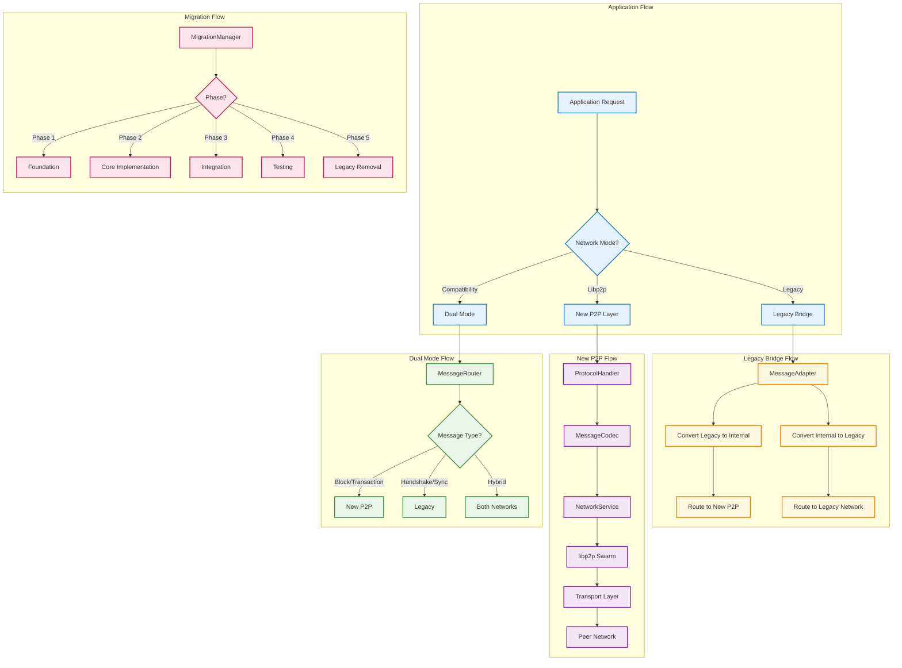
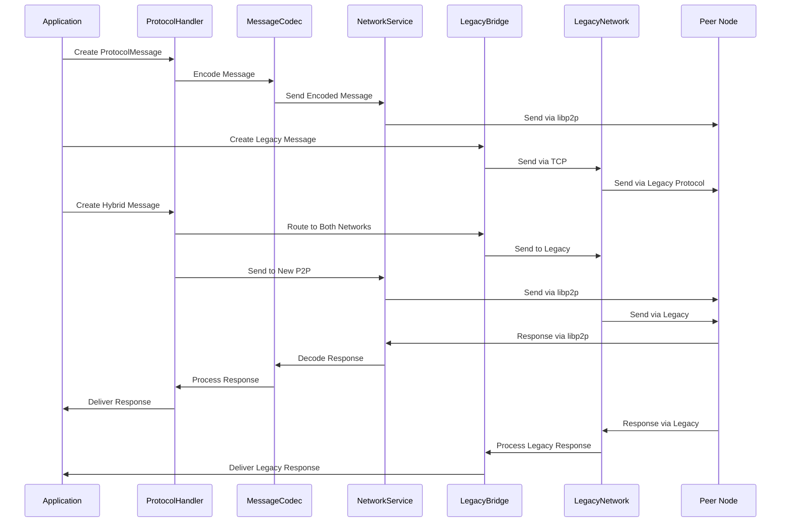
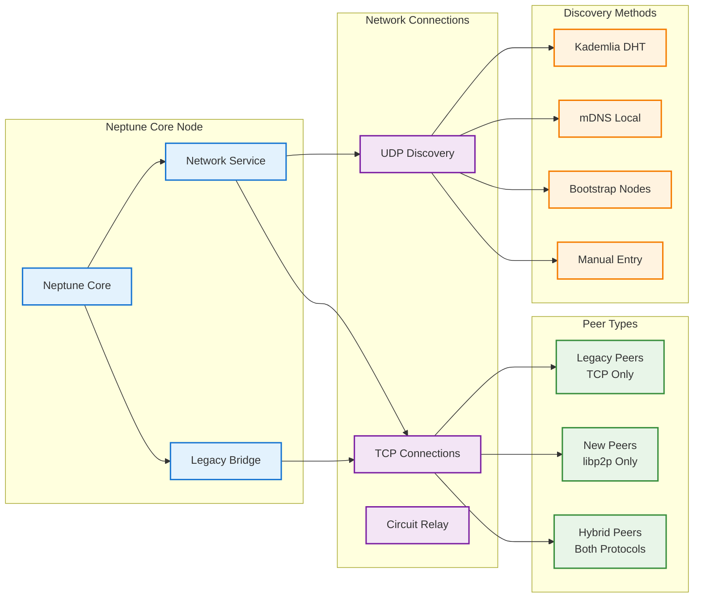
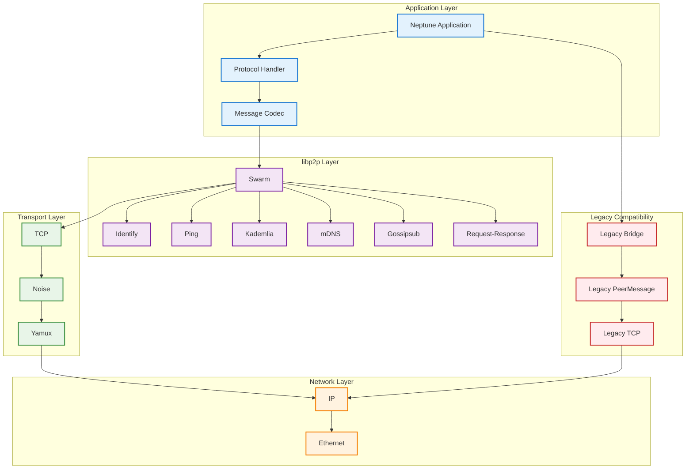

# Neptune Core P2P System Architecture

This document contains the Mermaid diagram showing our new P2P system architecture and how it integrates with the legacy network via our compatibility bridge.

## System Architecture Overview

```mermaid
graph TB
    %% Application Layer
    subgraph "Application Layer"
        ML[Main Loop]
        MLM[Mining Loop]
        RPC[RPC Server]
        BC[Blockchain]
        MP[Mempool]
    end

    %% New P2P Layer
    subgraph "New P2P Layer (libp2p)"
        NS[NetworkService]
        TS[TransportService]
        DS[DiscoveryService]
        PH[ProtocolHandler]
        MC[MessageCodec]
    end

    %% libp2p Protocols
    subgraph "libp2p Protocols"
        ID[Identify]
        PG[Ping]
        KD[Kademlia DHT]
        MD[mDNS]
        GS[Gossipsub]
        RR[Request-Response]
    end

    %% Compatibility Bridge
    subgraph "Compatibility Bridge"
        LB[LegacyBridge]
        MA[MessageAdapter]
        LNS[LegacyNetworkService]
        MM[MigrationManager]
    end

    %% Legacy Network
    subgraph "Legacy Network (TCP)"
        LML[Legacy Main Loop]
        LPL[Legacy Peer Loop]
        LCL[Legacy Connection Logic]
        LPM[Legacy PeerMessage]
    end

    %% Network Transport
    subgraph "Network Transport"
        TCP[TCP]
        NO[Noise Encryption]
        YM[Yamux Multiplexing]
    end

    %% Peer Network
    subgraph "Peer Network"
        P1[Peer 1]
        P2[Peer 2]
        P3[Peer 3]
        P4[Peer 4]
    end

    %% Application Layer Connections
    ML --> NS
    MLM --> NS
    RPC --> NS
    BC --> NS
    MP --> NS

    %% P2P Layer Internal
    NS --> TS
    NS --> DS
    NS --> PH
    PH --> MC

    %% Protocol Connections
    NS --> ID
    NS --> PG
    NS --> KD
    NS --> MD
    NS --> GS
    NS --> RR

    %% Transport Layer
    TS --> TCP
    TS --> NO
    TS --> YM

    %% Compatibility Bridge Connections
    NS --> LB
    LB --> MA
    LB --> LNS
    LB --> MM

    %% Legacy Network Integration
    LNS --> LML
    LNS --> LPL
    LNS --> LCL
    MA --> LPM

    %% Network to Peers
    TCP --> P1
    TCP --> P2
    TCP --> P3
    TCP --> P4

    %% Peer Discovery
    KD --> P1
    KD --> P2
    KD --> P3
    KD --> P4
    MD --> P1
    MD --> P2
    MD --> P3
    MD --> P4

    %% Message Flow
    GS --> P1
    GS --> P2
    GS --> P3
    GS --> P4
    RR --> P1
    RR --> P2
    RR --> P3
    RR --> P4

    %% Styling
    classDef appLayer fill:#e1f5fe,stroke:#01579b,stroke-width:2px
    classDef p2pLayer fill:#f3e5f5,stroke:#4a148c,stroke-width:2px
    classDef protocols fill:#e8f5e8,stroke:#1b5e20,stroke-width:2px
    classDef bridge fill:#fff3e0,stroke:#e65100,stroke-width:2px
    classDef legacy fill:#ffebee,stroke:#c62828,stroke-width:2px
    classDef transport fill:#f1f8e9,stroke:#33691e,stroke-width:2px
    classDef peers fill:#fce4ec,stroke:#880e4f,stroke-width:2px

    class ML,MLM,RPC,BC,MP appLayer
    class NS,TS,DS,PH,MC p2pLayer
    class ID,PG,KD,MD,GS,RR protocols
    class LB,MA,LNS,MM bridge
    class LML,LPL,LCL,LPM legacy
    class TCP,NO,YM transport
    class P1,P2,P3,P4 peers
```

## Detailed Component Relationships

## Message Flow Architecture

## Network Topology

## Protocol Stack

## Key Features and Benefits

### **Enhanced libp2p Protocols**
- **Identify**: Peer information exchange and version negotiation
- **Ping**: Connection health monitoring with RTT calculation
- **Kademlia DHT**: Distributed peer discovery and routing
- **mDNS**: Local network peer discovery
- **Gossipsub**: Efficient message broadcasting and subscription
- **Request-Response**: Direct peer communication for specific requests

### **Compatibility Bridge Benefits**
- **Seamless Migration**: Gradual transition from legacy to new network
- **Dual Protocol Support**: Operate both networks simultaneously
- **Message Translation**: Automatic conversion between protocol formats
- **Backward Compatibility**: Maintain existing functionality during transition

### **Performance Improvements**
- **Modern Networking**: Industry-standard libp2p protocols
- **Efficient Discovery**: Kademlia DHT for scalable peer discovery
- **Optimized Transport**: TCP + Noise + Yamux for performance
- **Message Compression**: zstd compression for reduced bandwidth
- **Encryption**: ChaCha20-Poly1305 for secure communication

### **Scalability Features**
- **Distributed Discovery**: Kademlia DHT for large-scale networks
- **Efficient Routing**: TTL-based message routing
- **Connection Multiplexing**: Yamux for multiple streams per connection
- **Peer Management**: Intelligent peer caching and cleanup

This architecture provides a robust, scalable, and future-proof P2P networking solution while maintaining full backward compatibility with the existing Neptune Core implementation.
