# Neptune Core P2P System - Complete Architecture Diagrams

## 🏗️ **System Architecture Overview**

This document provides comprehensive Mermaid diagrams showing the complete Neptune Core P2P system architecture, including the integration layer that connects the new P2P system to the main application.

## 🔄 **Complete System Architecture**

## 🔌 **Detailed Component Relationships**

## 🔄 **Message Flow Architecture**

## 🌐 **Network Topology Integration**

## ⚙️ **Configuration and Mode Management**

## 🔧 **Service Lifecycle and State Management**

## 📊 **Health Monitoring and Metrics**

## 🚀 **Migration and Transition Phases**

## 🔄 **Protocol Stack and Message Flow**

```mermaid
graph TB
    subgraph "Application Layer"
        A[Neptune Core] --> B[Block/Transaction]
        A --> C[Peer Management]
        A --> D[Network Status]
    end

    subgraph "Integration Layer"
        E[P2pIntegrationService] --> F[Message Router]
        E --> G[Protocol Handler]
        E --> H[Status Monitor]
    end

    subgraph "Protocol Translation"
        I[MessageAdapter] --> J[Legacy ↔ Internal]
        I --> K[Internal ↔ libp2p]
        I --> L[Validation & Routing]
    end

    subgraph "Network Layer"
        M[Legacy TCP] --> N[Legacy Peers]
        O[libp2p Stack] --> P[libp2p Peers]
    end

    subgraph "libp2p Protocol Stack"
        Q[Application Protocol] --> R[Gossipsub/Floodsub]
        Q --> S[Request-Response]
        Q --> T[Identify/Ping]
        Q --> U[Kademlia DHT]
        Q --> V[mDNS/Rendezvous]
        Q --> W[Circuit Relay]
        Q --> X[AutoNAT/DCUtR]
    end

    subgraph "Transport Layer"
        Y[TCP] --> Z[Noise Encryption]
        Z --> AA[Yamux Multiplexing]
    end

    %% Connections
    A --> E
    E --> I
    I --> M
    I --> O
    O --> Q
    Q --> Y
```

## 🎯 **Key Features and Benefits**

### **Enhanced libp2p Protocols**

- **Identify**: Peer information and version negotiation
- **Ping**: Connection health monitoring
- **Kademlia DHT**: Distributed peer discovery
- **mDNS**: Local network peer discovery
- **Gossipsub**: Efficient message broadcasting
- **Request-Response**: Direct peer communication
- **Circuit Relay**: NAT traversal and connection establishment
- **AutoNAT**: Automatic NAT detection and external address discovery
- **DCUtR**: Direct connection upgrade through relay
- **Rendezvous**: Peer discovery through rendezvous points
- **Floodsub**: Simple message flooding alternative

### **Compatibility Bridge Benefits**

- **Zero Downtime Migration**: Both systems run simultaneously
- **Backward Compatibility**: Legacy peers continue working
- **Protocol Translation**: Seamless message conversion
- **Gradual Migration**: Peers migrate at their own pace
- **Hybrid Operation**: Support for mixed legacy/new networks

### **Performance Improvements**

- **Enhanced Discovery**: Multiple peer discovery methods
- **NAT Traversal**: Automatic NAT detection and relay
- **Connection Resilience**: Automatic reconnection and recovery
- **Load Balancing**: Intelligent connection distribution
- **Message Optimization**: Efficient routing and delivery

### **Scalability Features**

- **DHT-based Discovery**: Scalable peer discovery
- **Protocol Multiplexing**: Multiple protocols over single connection
- **Connection Pooling**: Efficient connection management
- **Message Queuing**: Asynchronous message processing
- **Health Monitoring**: Proactive issue detection

---

This complete architecture provides Neptune Core with a robust, scalable, and future-proof P2P networking foundation while maintaining full backward compatibility with existing legacy networks. The integration layer ensures seamless operation and migration between the old and new networking systems.
